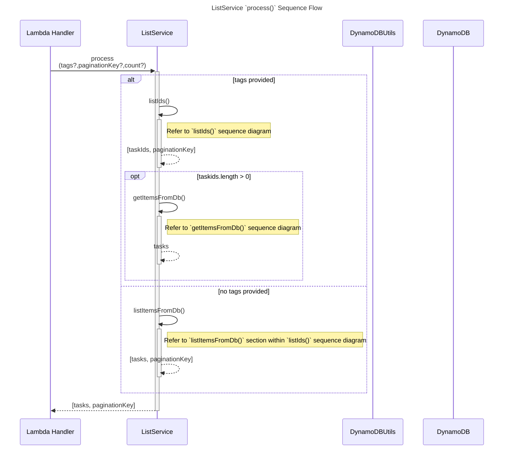
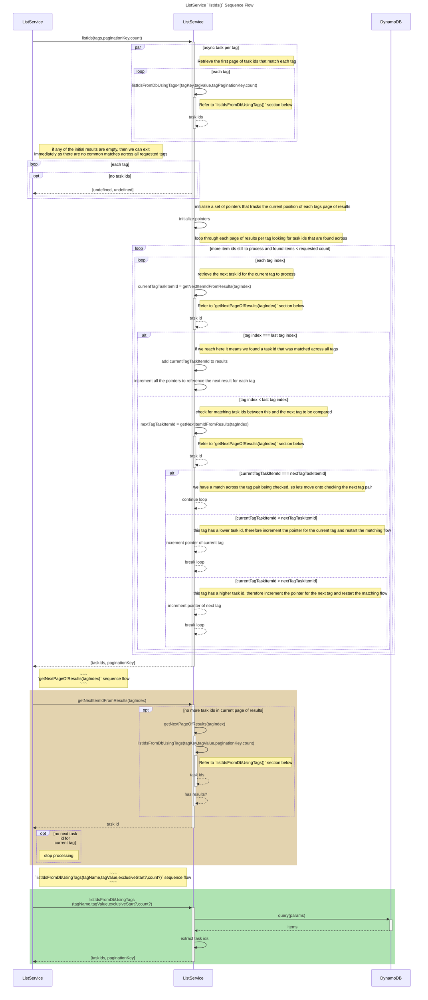
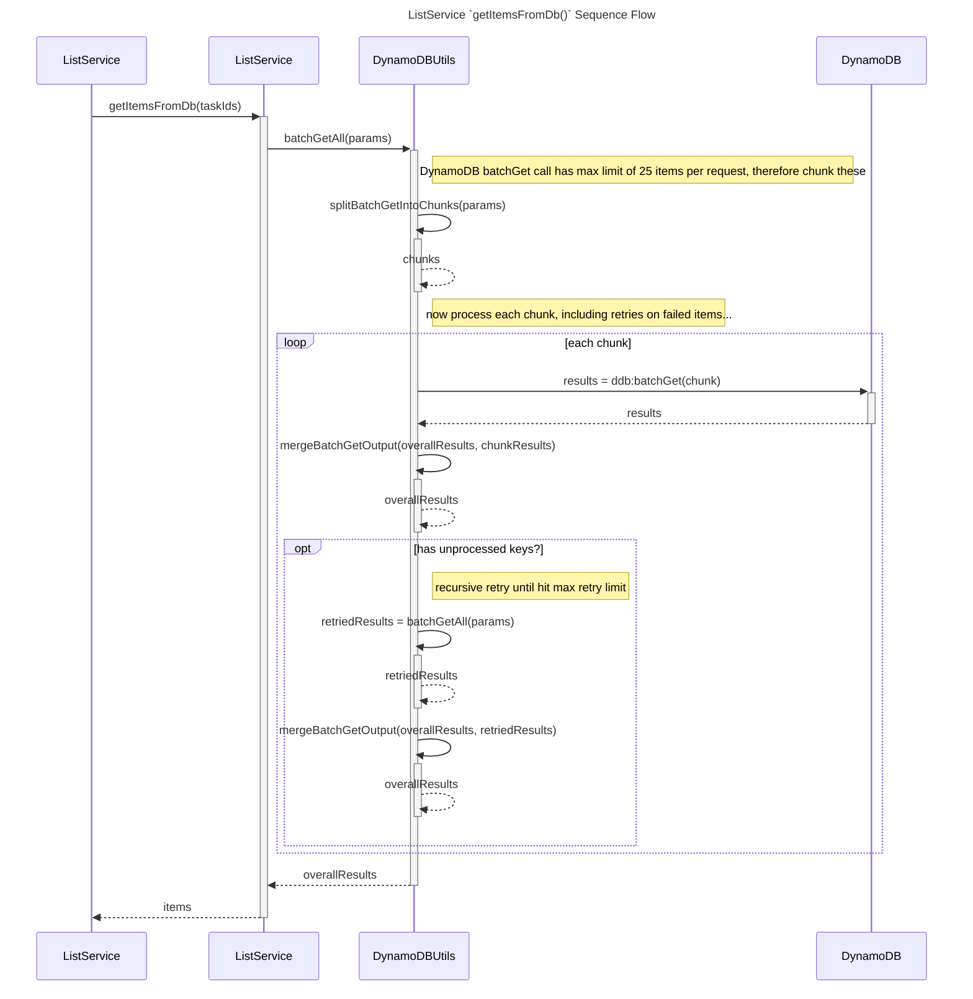

# Amazon DynamoDB Item Tagging

## Summary

Amazon DynamoDB is a fast and flexible NoSQL database service for single-digit millisecond performance at any scale. But in order to provide this scalability and performance, data access patterns must be known up front so that optimum keys and indexes can be designed. This is difficult in scenarios such as allowing the users of your platform to define any attributes for their data, then search that data filtering by any number of those attributes. This pattern outlines an approach to solve this problem by demonstrating how to structure a table and its indexes within DynamoDB to allow searching, then at the application layer how to efficiently aggregate results that match the multiple requests attributes.

As an example, let's say we have a task management application which allows users to create tasks as follows:

```json
{
    "id": "TASK_001",
    "name": "Read sample",
    "description": "Walk through the sample",
    "tags": {
        "project": "self improvement",
        "priority": "high",
        "severity": "low"
    }
}
```

What is relevant here is the `tags` property. In our application we allow its users to specify their own tags against their tasks (`project`, `priority`, and `severity` in this case), as well as querying their tasks based on any number of tag attribute keys and values they provide.

## Prerequisites 

* An active AWS account
* [AWS CLI](https://docs.aws.amazon.com/cli/latest/userguide/getting-started-install.html) installed, with credential configured using `aws configure`
* Node.js v16. It is recommended to install and use [nvm](https://github.com/nvm-sh/nvm) to manage multiple versions of node.js
* Install AWS CDK using `npm install -g aws-cdk`
* Docker (required by AWS CDK)

## Architecture


The infrastructure that is deployed as part of this pattern is relatively simple: an *Amazon API Gateway* proxies a `POST /tasks` REST API to a *AWS Lambda* function to save a task to *Amazon DynamoDB*. Likewise, *Amazon API Gateway* proxies a `GET /tasks` REST API to another *AWS Lambda* function that handles the querying of data. The complexity involved with this pattern is in the implementation of the querying logic carried out as part of the *List Items AWS Lambda* function.

## Database Table Design

* We take the approach of using a single Amazon DynamoDB table to store all data for the application.
* To facilitate querying items by any user defined tags, we use the [Adjacency List design pattern](https://docs.aws.amazon.com/amazondynamodb/latest/developerguide/bp-adjacency-graphs.html#bp-adjacency-lists) to store both task and tags data as separate items in the same table.
* [Composite sort keys](https://docs.aws.amazon.com/amazondynamodb/latest/developerguide/bp-sort-keys.html) are used to allow efficient querying of tag values.
* A single [sparse index](https://docs.aws.amazon.com/amazondynamodb/latest/developerguide/bp-indexes-general-sparse-indexes.html) allows querying all task items when no filtering by tags has been requested.
* Within the table we store 2 types of items: `task` and `tag`:

**Task item**

Attribute name | Attribute type | Example
---|---|---
`pk` (partition key) | String | `task#<id>` e.g. `task#TASK_001`
`sk` (sort key) | String | `task#<id>` e.g. `task#TASK_001`
`siKey1` | String | `task`
`name` | String | `Read sample`
`description` | String | `Walk through the sample`
`done` | Boolean | `false`
`tags` | Map | `{ "project": "self improvement", "priority": "high", "severity": "low" }`

**Tag item**

Attribute name | Attribute type | Example
---|---|---
`pk` (partition key) | String | `tag#<tagName>` e.g. `tag#project`
`sk` (sort key) | String | `<tagValue>#task#<taskId>` e.g. `self improvement#task#001`

**Global Secondary Index**

A sparse GSI (named `siKey1-sk-index` exists with partition key `siKey1` and sort key `sk` and a projection type of `ALL` (refer to `src/infra/amazon-dynamodb-item-tagging-stack.ts` for further details). 

**Sample data**
Taking the sample task item as listed in the summary, we store this as 4 separate items within the Amazon DynamoDB table as follows (refer to `src/lambda/create.ts` for further details on the implementation):

pk (partition key) | sk (sort key) | siKey1 | name | description | done | tags
---|---|---|---|---|---|---
`task#TASK--1` | `task#TASK--1` | `task` | `Read sample` | `Walk through the sample` | `false` | `{ "project": "self improvement", "priority": "high", "severity": "low" }`
`tag#project` | `self improvement#task#001` |  
`tag#priority` | `high#task#001` |  
`tag#severity` | `low#task#001` |  

## Application implementation walkthrough

The code files of interest are:

```
src/                                        // source code
├── infra/                                  // infrastructure as code (cdk)
│   └── amazon-dynamodb-item-tagging-stack.ts      // stack implementation
│   └── amazon-dynamodb-item-tagging-.spec.ts       // stack tests
├── lambda/                                 // lambda functions
│   └── create.ts                           // create task code
│   └── create.spec.ts                      // create tasks tests
│   └── create.handler.ts                   // create task lambda handler
│   └── list.ts                             // list task code
│   └── list.spec.ts                        // list task tests
│   └── list.handler.ts                     // list task lambda handler
│   └── models.ts                           // shared models
├── utils/                                  // utils    
│   └── dynamodb.util.ts                    // dynamodb helper utils
```

#### Creating Tasks

The code for creating tasks as described in the *Database table design* section is contained within the `CreateService process(item:TaskItem)` function located in `src/lambda/create.ts`. 

This class/method is wrapped by the lambda handler defined in `src/create.handler.ts` and is invoked by the *API Gateway* proxy to the *Lambda* function as defined in `src/infra/amazon-dynamodb-item-tagging-stack.ts`. The lambda handler takes the raw `APIGatewayEvent` object and invokes the `process` method with the extracted methods.

The `CreateService` class is separated from the lambda handler to allow for unit testing (refer to `src/lambda/create.spec.ts`).


#### Listing Tasks

Similar to the create tasks logic, the listing of tasks is implemented in the `ListService process(tags?: Tags, paginationKey?: TaskItemListPaginationKey, count?: number)` function located in `src/lambda/list.ts`, wrapped by the lambda handler defined in `src/lambda/list.handler.ts`, and tested in `src/lambda/list.spec.ts`.

Finding tasks that match all requested (user defined) tags is not (efficiently or cost effectively) possible in a single query using DynamoDB. Instead we need to query the table for all tasks per each filter, then attempt to find matching tasks across those different result sets at the application layer before returning the final result set. Along the way we may need to obtain the next page of results for any of the provided tags if the requested page size is greater than the number of tasks accumulated so far. The following sequence diagrams illustrate the process that allows this to be done in an efficient and scalable manner:








## Limitations

The algorithm used to implement the application is optimized for scalability and performance. However, its effectiveness is still heavily dependent on the cardinality of data of those user defined tags.

As an example, let's say we have the following to indicate a best case scenario:

* 10,000,000 tasks
* 50 tasks tagged with `project` of `self improvement`
* 80 tasks tagged with `priority` of `high`
* 20 tasks tagged with `severity` of `low`
* 3 tasks that match all tags

Best case is that the 3 tasks with all matching tags happen to be in the first page of results we return for each tag. This would entail 60 tag item reads (a page of 20 tag items per tag) followed by 3 task item reads.

Worst case is that the 3 tasks with all matching tags happen to be in the last page of results we return for each tag. This would entail 150 tag item reads (all tag items returned) followed by 3 task item reads.

As the next example, let's say we have the following to indicate a worst case scenario:

* 10,000,000 tasks
* 1,000,000 tasks tagged with `project` of `self improvement`
* 9,000,000 tasks tagged with `priority` of `high`
* 2,000,000 tasks tagged with `severity` of `low`
* 3 tasks that match all tags

Best case is that the 3 tasks with all matching tags happen to be in the first page of results we return for each tag. Like the last example, this would entail 60 tag item reads (a page of 20 tag items per tag) followed by 3 task item reads.

Worst case is that the 3 tasks with all matching tags happen to be in the last page of results we return for each tag. This would entail 12,000,000 tag item reads (all tag items returned) followed by 3 task item reads. 

That last example would be a very expensive query, as well as likely to exceed the Lambda function execution timeout. To alleviate this, the concept of composite tags could be used to reduce the number of tag item reads. For example, we could have a user defined composite tag `project_priority_severity` in addition to the existing as follows:

* 10,000,000 tasks
* 1,000,000 tasks tagged with `project` of `self improvement`
* 9,000,000 tasks tagged with `priority` of `high`
* 2,000,000 tasks tagged with `severity` of `low`
* 3 tasks tagged with `project_priority_severity` of `self improvement_high_low`

Both best and worst case scenarios of instead searching just using the composite tag results in 3 tag item reads and 3 task item reads.

## Deployment Steps

* Ensure all [prerequisites](#prerequisites) are met
* Clone this repository, and `cd` into its directory
* Build the application using `npm run build`
* Deploy the application using `cdk deploy --outputs-file ./cdk-outputs.json`
* Open `./cdk-outputs.json` and make a note of the  API Gateway URL where the application's REST API is deployed
* The following is an example of how to create new tasks

```http
POST /tasks HTTP/1.1

Request Headers:
    Accept: application/json
    Content-Type: application/json

Request Body:
    {
        "name": "Read sample",
        "description": "Walk through the sample",
        "tags": {
            "project": "self improvement",
            "priority": "high",
            "severity": "low"
        }
    }

Response Status: 
    201

Response Body:
    {
        "id": "d72hsy2is",
        "name": "Read sample",
        "description": "Walk through the sample",
        "tags": {
            "project": "self improvement",
            "priority": "high",
            "severity": "low"
        }
    }
```

* The following is an example of how to query tasks

```http
GET /tasks?tag=priority:high&tag=severity:low HTTP/1.1

Request Headers:
    Accept: application/json
    Content-Type: application/json

Response Status: 
    200

Response Body:
    {
        "items": [
            "id": "d72hsy2is",
            "name": "Read sample",
            "description": "Walk through the sample",
            "tags": {
                "project": "self improvement",
                "priority": "high",
                "severity": "low"
            }
        ]
    }
```


## Useful commands

 * `npm run build`   compile typescript to js
 * `npm run lint`    lint the code
 * `npm run test`    perform the jest unit tests
 * `cdk synth`       emits the synthesized CloudFormation template
 * `cdk diff`        compare deployed stack with current state
 * `cdk deploy`      deploy this stack to your default AWS account/region

## Security

See [CONTRIBUTING](CONTRIBUTING.md#security-issue-notifications) for more information.

## License

This library is licensed under the MIT-0 License. See the LICENSE file.
